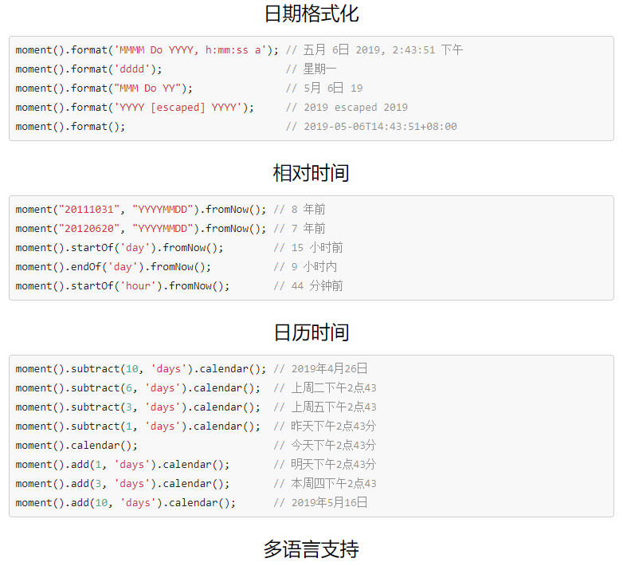

<!-- more -->
# 前端开发工具总结

## 开发工具
* [程序员在线工具](http://www.ofmonkey.com/)
> 加密解密、字符转换、代码格式化、正则表达式、单位换算、二维码生成、条形码生成		

* [字符转线条字-在线工具](http://www.bejson.com/convert/str2img/)  
* [Iconfont-阿里巴巴矢量图标库](https://www.iconfont.cn/)	
* [fontawesome图标在线查询](http://www.bejson.com/ui/fontawesome/)	
* [fontawesome矢量图标库](https://fontawesome.com/icons?from=io)	
* [fontawesome中文文档](http://www.fontawesome.com.cn/)	
* [在线代码编译器](http://www.bejson.com/pages/cooleditor/)	
* [在线正则表达式](http://tool.chinaz.com/tools/regexgenerate/)	
* [在线生成指定大小、格式(支持webp)的图片](http://www.bejson.com/ui/imagehandler/)	
* [在线图片格式转换](http://www.bejson.com/convert/picture_format/)	
* [Html/MarkDown互转工具](http://www.bejson.com/convert/html2markdown/)	
* [在线gif制作工具](http://www.matools.com/gif)
* [Web酷炫特效在线地址](http://gnipbao.github.io/h5-test/menu.html)
* [腾讯智图-图片压缩](http://zhitu.isux.us/)

## CSS在线工具
[阴影](https://testdrive-archive.azurewebsites.net/Graphics/hands-on-css3/hands-on_box-shadow.htm)	
[圆角](https://testdrive-archive.azurewebsites.net/Graphics/hands-on-css3/hands-on_box-shadow.htm)	
[文本阴影](https://testdrive-archive.azurewebsites.net/Graphics/hands-on-css3/hands-on_box-shadow.htm)	

## 辅助工具
[汉字拼音转换](https://www.npmjs.com/package/pinyin)	
[Bootstrap可视化布局系统](http://www.bootcss.com/p/layoutit/)	
[常用的HTML和CSS content属性特殊字符归纳](https://blog.csdn.net/zx562602419/article/details/81020342)	
[验证码插件Verify](https://veui.net/)  
> 开源，免费的验证码插件，自适应兼容移动端！			

[swiper](https://2.swiper.com.cn/)		
> Swiper常用于移动端网站的内容触摸滑动
> 

[基于HTML5 canvas圆形倒计时器jQuery插件效果演示](http://www.htmleaf.com/Demo/201502111367.html)
> 这是一款基于html5 canvas的圆形倒计时器jQuery插件。它可以使你非常轻松的创建圆形的倒计时器。该jQuery倒计时器插件有12种themes，它们基于 HTML5 canvas 来渲染各种圆环。
> 

[html5视频背景插件vidbacking](http://demo.htmleaf.com/1707/201707251501/index.html)
> vidbacking是一款响应式的，跨平台的html5视频背景插件。该视频背景插件允许你在页面中的某个div后整个页面中使用HTML5视频作为背景
> 

[17种基于mo.js制作的炫酷图标动画特效](http://www.htmleaf.com/html5/SVG/201602243142.html)
> 这是一款基于mo.js制作的一组炫酷图标动画特效。这组图标动画共有17种效果，它们使用font-awesome作为图标，采用SVG技术，在用户点击图标时产生各种炫酷的图标动画特效
> 

[jTopo](http://www.jtopo.com/index.html)
> 是一款完全基于HTML5 Canvas的关系、拓扑图形化界面开发工具包。
> jTopo关注于数据的图形展示，它是面向开发人员的，需要进行二次开发。
> 使用jTopo很简单，可以快速创建一些关系图、拓扑等相关图形化的展示。只要您的数据之间存在有关联关系，都可以使用jTopo来进行人性化、图形化的展示。
> jTopo的目标：1.简单好用 2.灵活扩展 3.轻松开发出类似Visio、在线脑图、UML建模等类似工具 4.为大数据可视化提供解决方案  


[大屏可视化界面](http://www.jq22.com/yanshi21708)
> 基于echarts的大数据页面
> 

[大屏页面参考链接](http://www.bootstrapmb.com/tag/dapingmu)
## 缓存	
[storage](https://github.com/ustbhuangyi/storage)	

## JavaScript
[Babel](https://babeljs.io/docs/en/)	
>Babel是一个工具链，主要用于将ECMAScript 2015+代码转换为当前和旧版浏览器或环境中的向后兼容版本的JavaScript		

## 第三方库
### jQuery左右箭头和鼠标控制的板块滚动
[demo](http://www.jq22.com/demo/jQuery-hk-150407214616/)


### jQuery放大镜插件  		
[demo1](http://www.jq22.com/demo/demo2jQzoom-141021091548/)
		

  		
[demo2](http://www.jq22.com/demo/jQuery-Zoom20160322/)


[demo3](http://www.jq22.com/demo/jQueryJpg201708110048/)
	

### 懒加载插件
[参考链接](https://www.npmjs.com/package/lazy-load-img)
#### 使用方法
```
var lazyLoadImg = new LazyLoadImg({
	el: ul,    // dom元素下的图片
	mode: 'diy',    // 模式: 默认/自定义
	time: 300,    // 多长时间重新监听一次
	complete: true,    // 完成后自己销毁程序
	position: {    // 只要其中一个位置符合条件，都会触发加载机制
			top: 0,    // 元素距离顶部
			left: 0,    // 元素距离右边
			right: 0,    // 元素距离下面
			bottom: 0    // 元素距离左边
	},
	diy: { //设置图片剪切规则，diy模式时才有效果
			backgroundSize: 'cover',
			backgroundRepeat: 'no-repeat',
			backgroundPosition: 'center center'
	},
	before: function() {

	},
	success: function(el) {
			el.classList.add('success');
	},
	error: function(el) {
			el.src = './images/error.png';
	}
});
```
#### 实例参考（lazy-load-img文件夹）
### 红包雨特效		
[demo](http://www.jq22.com/demo/jqueryhby201811150953/)		


### 图片放大插件		
[elevateZoom中文文档](https://www.myfreax.com/elevatezoom-image-zoom/)  
[demo](https://demo.demohuo.top/jquery/5/521/demo/)


## 日期处理库
### JavaScript 日期处理类库
[momentjs](http://momentjs.cn/)		
		

## 可视化工具		
#### ECharts，一个使用 JavaScript 实现的开源可视化库，可以流畅的运行在 PC 和移动设备上，兼容当前绝大部分浏览器（IE8/9/10/11，Chrome，Firefox，Safari等），底层依赖轻量级的矢量图形库 ZRender，提供直观，交互丰富，可高度个性化定制的数据可视化图表。
[echarts](https://www.echartsjs.com/index.html)
## 兼容
### IE6-8不支持CSS3 Medi
