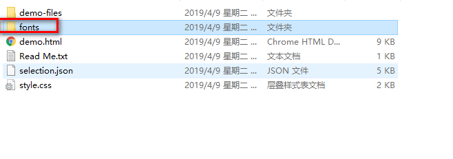

<!-- more -->
# 前端开发工具总结

## 在线工具
* [程序员在线工具](http://www.ofmonkey.com/)
> 加密解密、字符转换、代码格式化、正则表达式、单位换算、二维码生成、条形码生成		

* [字符转线条字-在线工具](http://www.bejson.com/convert/str2img/)  
* [Iconfont-阿里巴巴矢量图标库](https://www.iconfont.cn/)	
* [fontawesome图标在线查询](http://www.bejson.com/ui/fontawesome/)	
* [fontawesome矢量图标库](https://fontawesome.com/icons?from=io)	
* [fontawesome中文文档](http://www.fontawesome.com.cn/)	
* [在线代码编译器](http://www.bejson.com/pages/cooleditor/)	
* [在线正则表达式](http://tool.chinaz.com/tools/regexgenerate/)	
* [在线生成指定大小、格式(支持webp)的图片](http://www.bejson.com/ui/imagehandler/)	
* [在线图片格式转换](http://www.bejson.com/convert/picture_format/)	
* [Html/MarkDown互转工具](http://www.bejson.com/convert/html2markdown/)	

## CSS在线工具
[阴影](https://testdrive-archive.azurewebsites.net/Graphics/hands-on-css3/hands-on_box-shadow.htm)	
[圆角](https://testdrive-archive.azurewebsites.net/Graphics/hands-on-css3/hands-on_box-shadow.htm)	
[文本阴影](https://testdrive-archive.azurewebsites.net/Graphics/hands-on-css3/hands-on_box-shadow.htm)	

## 辅助工具
[汉字拼音转换](https://www.npmjs.com/package/pinyin)	
[Bootstrap可视化布局系统](http://www.bootcss.com/p/layoutit/)	
[常用的HTML和CSS content属性特殊字符归纳](https://blog.csdn.net/zx562602419/article/details/81020342)	
## 缓存	
[storage](https://github.com/ustbhuangyi/storage)	

## JavaScript
[Babel](https://babeljs.io/docs/en/)	
>Babel是一个工具链，主要用于将ECMAScript 2015+代码转换为当前和旧版浏览器或环境中的向后兼容版本的JavaScript		

## jQuery插件
### jQuery左右箭头和鼠标控制的板块滚动
[demo](http://www.jq22.com/demo/jQuery-hk-150407214616/)


### jQuery放大镜插件  		
[demo1](http://www.jq22.com/demo/demo2jQzoom-141021091548/)
		

  		
[demo2](http://www.jq22.com/demo/jQuery-Zoom20160322/)


[demo3](http://www.jq22.com/demo/jQueryJpg201708110048/)
	

### 懒加载插件
[参考链接](https://www.npmjs.com/package/lazy-load-img)
#### 使用方法
```
var lazyLoadImg = new LazyLoadImg({
	el: ul,    // dom元素下的图片
	mode: 'diy',    // 模式: 默认/自定义
	time: 300,    // 多长时间重新监听一次
	complete: true,    // 完成后自己销毁程序
	position: {    // 只要其中一个位置符合条件，都会触发加载机制
			top: 0,    // 元素距离顶部
			left: 0,    // 元素距离右边
			right: 0,    // 元素距离下面
			bottom: 0    // 元素距离左边
	},
	diy: { //设置图片剪切规则，diy模式时才有效果
			backgroundSize: 'cover',
			backgroundRepeat: 'no-repeat',
			backgroundPosition: 'center center'
	},
	before: function() {

	},
	success: function(el) {
			el.classList.add('success');
	},
	error: function(el) {
			el.src = './images/error.png';
	}
});
```
#### 实例参考（lazy-load-img文件夹）
### 红包雨特效		
[demo](http://www.jq22.com/demo/jqueryhby201811150953/)		


### 图片放大插件		
[elevateZoom中文文档](https://www.myfreax.com/elevatezoom-image-zoom/)  
[demo](https://demo.demohuo.top/jquery/5/521/demo/)

## 兼容
### IE6-8不支持CSS3 Media Queries解决：https://www.bootcdn.cn/respond.js/
### IE9以下不支持h5解决：
``` 
<!--[if lt IE 9]>    //判断当前浏览器的版本是否小于IE 9
<script src="https://oss.maxcdn.com/libs/html5shiv/3.7.0/html5shiv.js"></script>
```

## 其他
### 前端开发工具辅助总卷：https://www.jianshu.com/p/6e635191205a
### Markdown 语法整理大集合2017 - 简书：https://www.jianshu.com/p/b03a8d7b1719

[在线gif制作工具](http://www.matools.com/gif)

[iconmoon](https://icomoon.io/app/#/select)	
这是一个图标库，可以将.svg文件商城字体图标并应用		
下面是制作字体的步骤：	


	
将下载的包解压，将fonts文件放到你的项目中


## Vue开发相关工具和第三方库
### Axios	
[npm安装及使用](https://www.kancloud.cn/yunye/axios/234845)	
#### 使用方法与步骤	
1.npm install axios		
2.执行GET请求		
```
// 为给定 ID 的 user 创建请求
axios.get('/user?ID=12345')
  .then(function (response) {
    console.log(response);
  })
  .catch(function (error) {
    console.log(error);
  });

// 可选地，上面的请求可以这样做
axios.get('/user', {
    params: {
      ID: 12345
    }
  })
  .then(function (response) {
    console.log(response);
  })
  .catch(function (error) {
    console.log(error);
  });
  ```

3. 执行POST请求
```
axios.post('/user', {
    firstName: 'Fred',
    lastName: 'Flintstone'
  })
  .then(function (response) {
    console.log(response);
  })
  .catch(function (error) {
    console.log(error);
  });
```
4.执行多个并发请求	

```
function getUserAccount() {
  return axios.get('/user/12345');
}

function getUserPermissions() {
  return axios.get('/user/12345/permissions');
}

axios.all([getUserAccount(), getUserPermissions()])
  .then(axios.spread(function (acct, perms) {
    // 两个请求现在都执行完成
  }));
```
### better-scroll 
[参考链接](https://github.com/ustbhuangyi/better-scroll/blob/master/README_zh-CN.md)
##### better-scroll 是一款重点解决移动端（现已支持 PC 端）各种滚动场景需求的插件。它的核心是借鉴的 iscroll 的实现，它的 API 设计基本兼容 iscroll，在 iscroll 的基础上又扩展了一些 feature 以及做了一些性能优化
#### 使用步骤
* npm install better-scroll
* import BScroll from 'better-scroll'		
```
import BScroll from 'better-scroll'
let wrapper = document.querySelector('.wrapper')
let scroll = new BScroll(wrapper)
```
### Vuex	
### 使用步骤		
[vuex](https://vuex.vuejs.org/zh/guide/)
## PS使用
### 快捷键
> Ctrl + h 显示/隐藏参考线     
> Alt + 鼠标 缩放     
> 空格 + 鼠标 移动        
> 新建图形文件【Ctrl】+【N】     
> 新建图层【Ctrl】+【Shift】+【N】      
> 反向选择 【Ctrl】+【Shift】+【I】     
> 还原两步以上操作 【Ctrl】+【Alt】+【Z】     
> 剪切选取的图像或路径 【Ctrl】+【X】或【F2】      
> 从对话框新建一个图层 【Ctrl】+【Shift】+【N】     
> 以默认选项建立一个新的图层 【Ctrl】+【Alt】+【Shift】+【N】      
> 通过拷贝建立一个图层 【Ctrl】+【J】     
> 通过剪切建立一个图层 【Ctrl】+【Shift】+【J】     
> ctrl+d-取消选定区域     
> ctrl+w-关闭文件     
> ctrl+Q-退出ps     
## 前端面试准备
### 参考链接
[前端面试知识点目录整理](https://mp.weixin.qq.com/s/8rbp-f1j8kz8XDxpAiSLvA?tdsourcetag=s_pcqq_aiomsg)

## CMD 使用
### 生成项目树
#### 在要生成的文件夹中 shift+鼠标右键打开cmd，输入tree /f，然后复制项目树就行
## 游戏开发
### 工具
		
		
### 文档
[白鹭开发者中心](http://developer.egret.com/cn/)	
